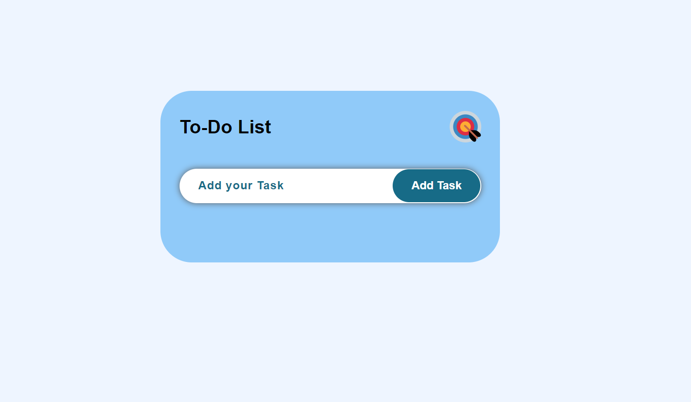
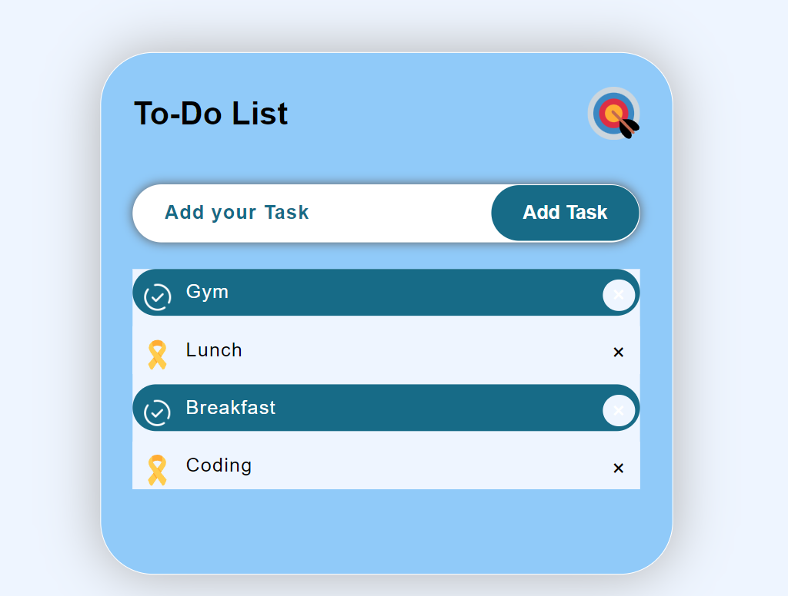

<br/>
<p align="center">

  <h1 align="center">To-Do-List WebApp</h1>

  <p align="center">
    This web application is designed to help you manage your tasks efficiently and stay organized.!
    <br/>
    <br/>
    <a href="https://github.com/Namratapatel9027/To-Do-List-WebApp"><strong>Explore the Project »</strong></a>
    <br/>
    <br/>
<!--     <a href="https://github.com/ShaanCoding/ReadME-Generator">View Demo</a>
    . -->
  </p>
</p>


## Table Of Contents

* [About the Project](#about-the-project)
* [Built With](#built-with)
* [Getting Started](#getting-started)
  * [Installation](#installation)
* [Contributing](#contributing)
* [License](#license)

## About The Project

<h1 align="center">Screenshots</h1>




This web application is designed to help you manage your tasks efficiently and stay organized. Whether you're a busy professional, a student juggling multiple assignments, or just someone who likes to keep track of things, this app is for you.

Here's why:

* User-friendly Interface: The application provides an intuitive and easy-to-use interface, making task management a breeze.
* Task Creation: Add tasks quickly and easily with a simple form.
* Task Categories: Organize your tasks into different categories or lists to keep things structured.
* Task Prioritization: Prioritize your tasks by marking them as high, medium, or low priority.
* Task Filtering: Filter tasks based on categories, priority levels, or completion status to focus on what matters most.
* Task Editing and Deletion: Easily edit or delete tasks as your priorities change.
* Responsive Design: The application is responsive and works seamlessly across devices, including desktops, tablets, and smartphones.

## Built With

Frontend: HTML, CSS, JavaScript

## Getting Started

This is an example of how you can setting up the project locally.
To get started with the To-Do List Web Application, follow these steps:

### Installation

1. Clone the Repository: Clone this repository to your local machine using the following command:

```sh
git clone https://github.com/Namratapatel9027/to-do-list-webapp.git
```

2. Navigate to the Directory: Move into the project directory:

```sh
cd todo-list-webapp
```

3. Install Dependencies: Install the necessary dependencies by running:

```sh
npm install
```

4. Start the Server: Start the development server by running:

```sh
npm start
```

## Contributing

Contributions are welcome! If you find any bugs or have suggestions for new features, please open an issue or submit a pull request. For major changes, please open an issue first to discuss the proposed changes.

## License

This project is licensed under the MIT License - see the LICENSE file for details.

Thank you for choosing the To-Do List Web Application. Happy task managing! 🚀
